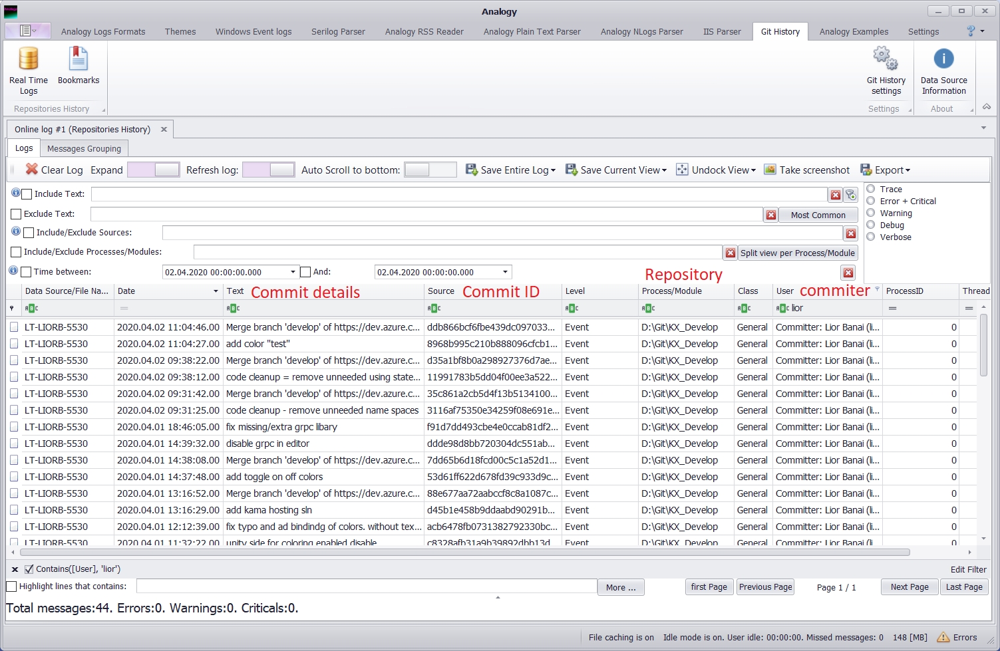
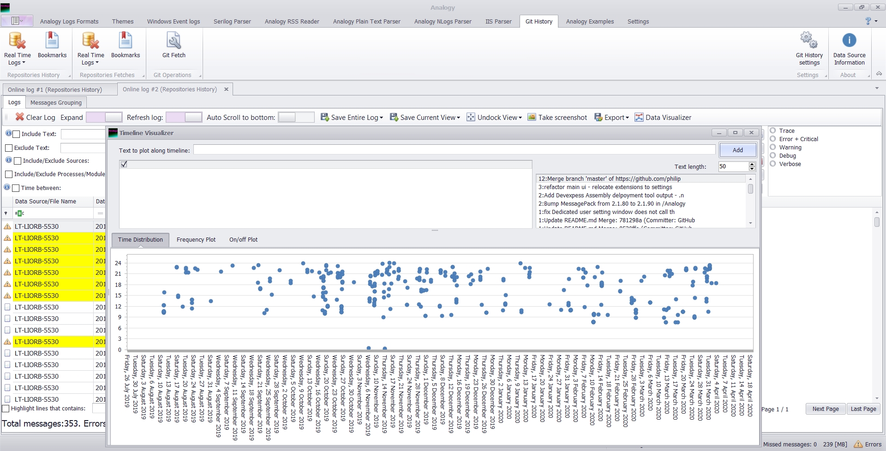

# Analogy.LogViewer.GitHistory 

  
 

 
 
 
 

Display git history or your local repository in Analogy Log Viewer

With GitHistory you can see all your team commits and have some statistics such as when during the day most of the commits are done:

